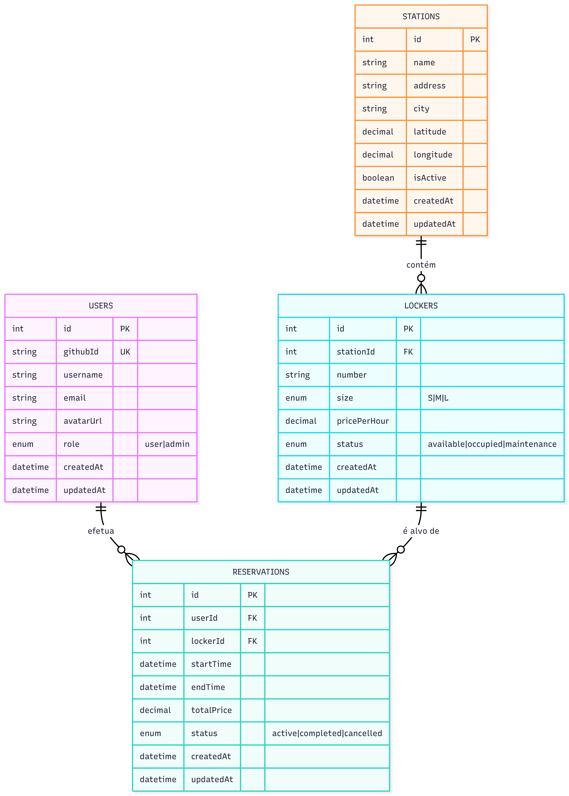

# C2 : Resources

A API expõe três recursos principais (`stations`, `lockers`, `reservations`) e dois auxiliares (`users` e `auth`). As entidades estão modeladas em MySQL via Sequelize.

## 2.1 Modelo de Dados

A relação `1:N` que cumpre o requisito do enunciado é `stations -> lockers` (uma estação tem vários cacifos). Existem também `users -> reservations` e `lockers -> reservations`, declaradas em `src/models/index.js` via `hasMany`/`belongsTo`.

A base de dados é populada por um *seeder* (`src/seeders/seed.js`) com 30 estações reais, 90 cacifos (3 por estação, tamanhos S/M/L), 30 utilizadores e 30 reservas.

## 2.2 Endpoints da API

A API expõe 19 endpoints distribuídos por quatro áreas:

| Método | URL | Descrição | Acesso |
| --- | --- | --- | --- |
| GET | `/auth/github` | Inicia OAuth2 GitHub | Público |
| GET | `/auth/github/callback` | Callback do GitHub | Público |
| GET | `/auth/me` | Perfil do utilizador autenticado | Autenticado |
| GET | `/auth/logout` | Termina sessão | Público |
| GET | `/api/stations` | Lista estações | Público |
| GET | `/api/stations/:id` | Detalhe + cacifos | Público |
| POST/PUT/DELETE | `/api/stations` | CRUD de estações | Autenticado |
| GET | `/api/lockers` | Lista cacifos | Autenticado |
| GET | `/api/lockers/:id` | Detalhe + estação | Autenticado |
| POST/PUT/DELETE | `/api/lockers` | CRUD de cacifos | Autenticado |
| GET | `/api/reservations` | Lista as minhas reservas | Autenticado |
| GET | `/api/reservations/:id` | Detalhe (apenas dono) | Autenticado |
| POST | `/api/reservations` | Cria reserva (`userId` da sessão) | Autenticado |
| PUT | `/api/reservations/:id` | Atualizar | Apenas dono |
| DELETE | `/api/reservations/:id` | Remover | Apenas dono |
| GET | `/api/docs` | Documentação Swagger UI | Público |

### Convenções

- Verbos HTTP semânticos (GET, POST, PUT, DELETE);
- Status codes: `200`, `201`, `204`, `400`, `401`, `403`, `404`;
- Respostas sempre em JSON, incluindo erros (`{ "error": "mensagem" }`);
- *Eager loading* via `include` do Sequelize, para devolver estruturas aninhadas num só pedido.

---

| [< Previous](c1.md) | [^ Main](../README.md) | [Next >](c3.md) |
| :--- | :---: | ---: |
